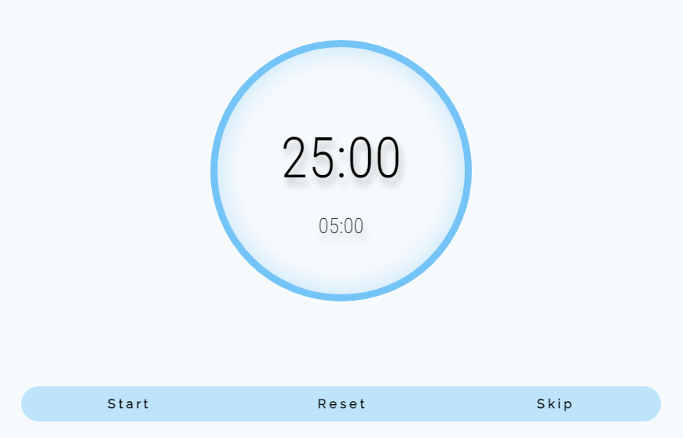
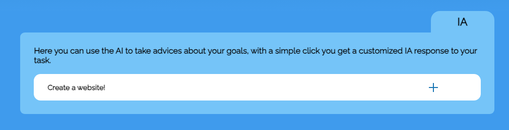

# POMODORO TIMER

## Functionalities

This project it's a pomodor timer with two functionalities extra, first the the timer works in the background so you don't have to keep it open, second you have a **Goal list** that have localStorage to keep track of your goals and last, you have access to the AI of ChatGPT to get an advice for your goals, this advice have localStorage too, so you don't lose it if you close the tab. All this with a Minimalist design to help the user **stay focused** on work or study.

## Instalation

If you are a Developer and want to download the repository and run it in your machine or create some special features, just do this:

### Fork

Fork the repo and install the dependencies.

### Create a .env file

In this project, I use Express so you need an **API KEY** from OpenAI and assign a port in your .env file. The API key you can get it creating an account in OpenAI and go to [API KEY](https://platform.openai.com/api-keys)

### Run the project

Now you can modify, use, or whatever you wanna do.

## Use of the project

If you wanna use this web, there are three special features available:

### Timer

The first button is for **starting** and **stoping** the timer, the second button it's for reset the timer and the last button it's for jump the turn.

### Goal list

Your second feature it's a todo list, in this list I create a CRUD, you can add a goal in the first section, **complete** a goal with the checkbox, this will delete it in a moment, you can **edit** a goal, and you can finally **delete** it.

### AI

In this section, you have a dropdown menu that will display a advice for your goal from the OpenAI API to help you to complete the goals.

> I create this project to practice my skills with Vanilla JavaScript and HTML and CSS without frameworks, i just have to add some dependencies to build the server for the API, I hope you find it interesting!

## Contact

[Twitter](https://twitter.com/TimmyElTaco)
[LinkedIn](https://www.linkedin.com/in/luis-guzman-bautista/)
